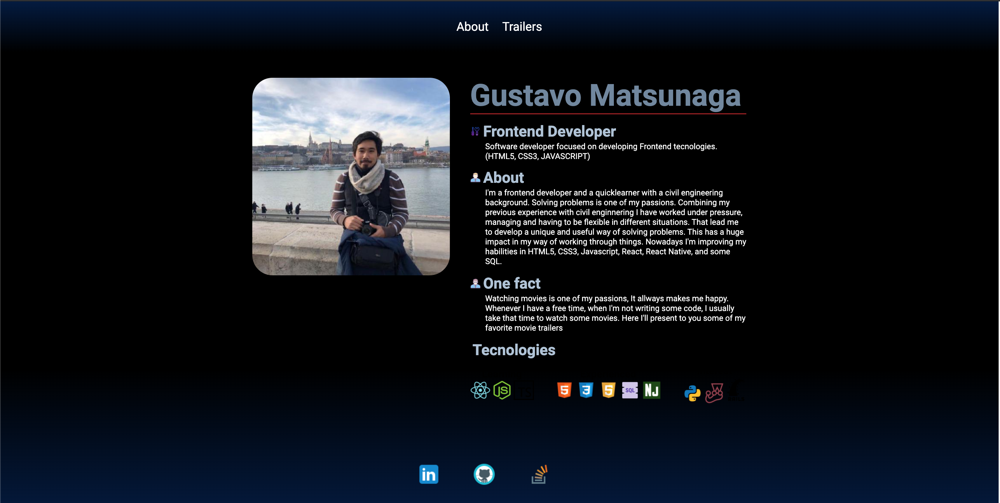

  <a href="#tecnologies">Technologies</a>&nbsp;&nbsp;&nbsp;|&nbsp;&nbsp;&nbsp;
  <a href="#project">Project</a>&nbsp;&nbsp;&nbsp;|&nbsp;&nbsp;&nbsp;
  <a href="#memo-licença">Licença</a>

 

  

## :spades: Technologies
Since I'm a fan of movies I started this project to practice some frontend and backend tecnologies. The focus will be to make an landing page describing my profile and another page with some movie trailers and some features. The technologies I am going to use are : HTML5, CSS3, JAVASCRIPT, EXPRESS, NUNJUCKS.
This project was developed by using :

- [Node.js](https://nodejs.org/en/)
- [Express](https://expressjs.com/)
- [Nunjucks](https://mozilla.github.io/nunjucks/)

---

By Gustavo Matsunaga.
